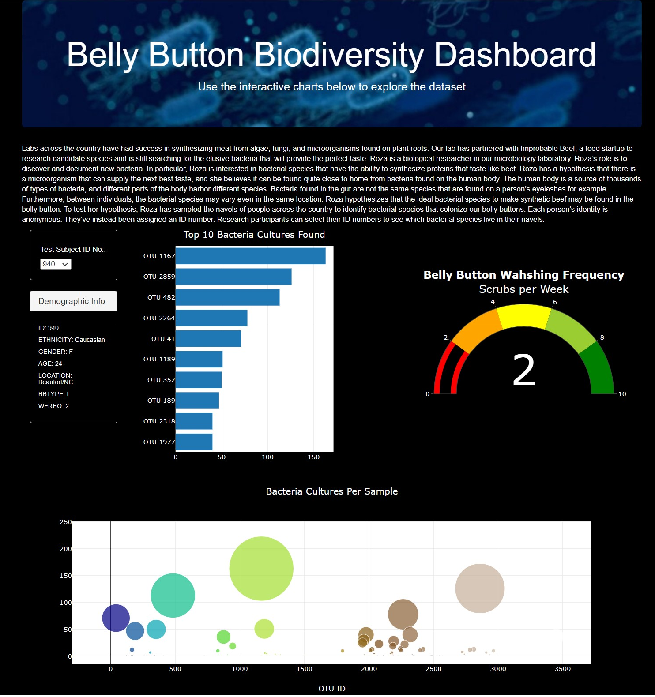

# Belly Button Biodiversity Dashboard

## Project Overview

Roza is a biological researcher in a prominent microbiology laboratory. Roza’s role is to discover and document new bacteria. In particular, Roza is interested in bacterial species that have the ability to synthesize proteins that taste like beef. Her lab has partnered with Improbable Beef, a food startup to research candidate species. Labs across the country have had success in synthesizing meat from algae, fungi, and microorganisms found on plant roots. However, Improbable Beef is still searching for the elusive bacteria that will provide the perfect taste. Roza has a hypothesis that there is a microorganism that can supply the next best taste, and she believes it can be found quite close to home from bacteria found on the human body. 
The human body is a source of thousands of types of bacteria, and different parts of the body harbor different species. Bacteria found in the gut are not the same species that are found on a person’s eyelashes for example. Furthermore, between individuals, the bacterial species may vary even in the same location. Roza hypothesizes that the ideal bacterial species to make synthetic beef may be found in the belly button. To test her hypothesis, Roza has sampled the navels of people across the country to identify bacterial species that colonize our belly buttons. Each person’s identity is anonymous. They’ve instead been assigned an ID number.
The propose of this project is to help Roza build a dashboard using JavaScript and Plotly.js that can be accessed by research participants and researchers. Also, allow research participants to be able to visit a website and select their ID numbers to see which bacterial species live in their navels.

# Result 

Website: https://jagpreetbath.github.io/Bellybutton-Biodiversity/